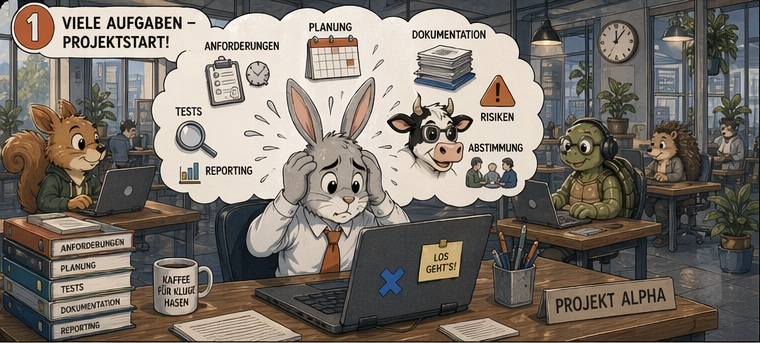
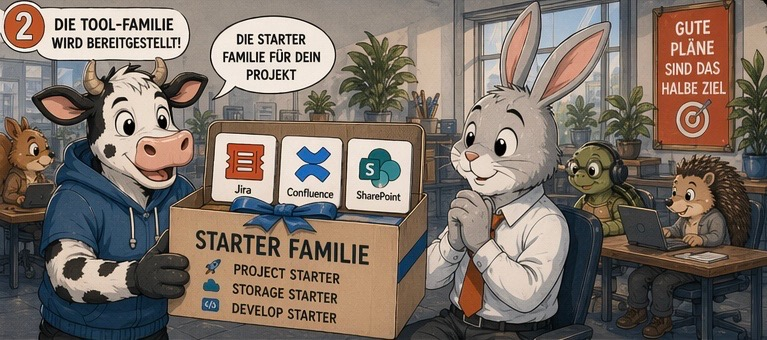
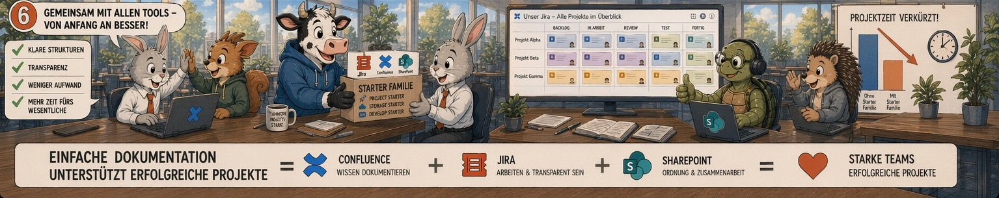

# CLAUDE.md

This file provides guidance to Claude Code (claude.ai/code) when working with code in this repository.

## Quiz App

JavaScript-Quiz, das den Spieler durch 6 Fragen führt. Pro Frage wird genau ein Bild angezeigt; korrekte Antwort wechselt zum nächsten Bild und zur nächsten Frage. Nach Q6 erscheint der Schlussbildschirm.

## Entwicklung

Die App besteht aus genau einer Datei: `index.html`. Kein Build-Tool, kein npm, keine externe Abhängigkeit, kein HTTP-Server nötig — die Datei kann direkt per `file://` geöffnet werden, da die Fragen als JSON inline im HTML-Head liegen (kein `fetch()` mehr).

Optional ein lokaler Server:

```bash
python3 -m http.server 8080
# oder
npx serve .
```

## Architektur

Alles in `index.html`: CSS im `<head>`, JSON-Fragenpool im `<head>`, JavaScript am Ende des `<body>`. Keine externen Skripte oder Stylesheets.

**Drei Screens** (per CSS `opacity` + `pointer-events` umgeschaltet, 0.4 s Transition):
- `#start-screen` — zeigt `images/bild1.jpg` + Headline + Start-Button + KI-Hinweis
- `#quiz-screen` — Bildbereich + Fragebereich
- `#end-screen` — zeigt `images/Hintergrundbild.png` + Glückwunsch-Text + „Nochmal spielen"-Button

### Bildwechsel: Szene-DIVs mit Crossfade

Der Quizbildbereich (`#image-area`) enthält **6 vorab gerenderte `.scene`-DIVs**, je mit einem ``. Alle Bilder liegen permanent im DOM und sind damit vorab dekodiert.

```html
<div id="image-area">
  <div class="scene active"></div>
  <div class="scene"></div>
  ...
  <div class="scene"></div>
</div>
```

Wechsel erfolgt durch Toggle der `.active`-Klasse — CSS `transition: opacity 0.4s` erzeugt automatisch einen Crossfade. **Wichtig**: Kein `src`-Tausch verwenden, das hatte historisch Decoding-Races verursacht (alte Bytes blieben während Fade-in sichtbar).

`setQuizImage(idx, { onSwap })` setzt die aktive Szene; `hideAllScenes()` blendet alle aus (vor dem Wechsel zum Endbildschirm).

### Spielfluss

`NUM_QUESTIONS = 6`. Die 6 Bilder sind 1:1 auf die Fragen gemappt:

| Frage | Bild |
|---|---|
| Q1 | `bild1.jpg` (selbes Bild wie Startbildschirm) |
| Q2 | `szene2.jpg` |
| Q3 | `szene3.jpg` |
| Q4 | `szene4.jpg` |
| Q5 | `szene5.jpg` |
| Q6 | `szene6.jpg` |
| nach Q6 | Wechsel zum Endbildschirm (`Hintergrundbild.png`) |

### Fragendaten (JSON inline)

Fragenpool als JSON-Block im `<head>`:

```html
<script id="questions-data" type="application/json">
[
  { "question": "...", "correct": "...", "wrong": ["...", "..."] },
  ...
]
</script>
```

- Beim Seitenstart per `JSON.parse(document.getElementById('questions-data').textContent)` geladen.
- Pool muss mindestens 6 Einträge enthalten, sonst wird der Quiz-Start verweigert.
- Aus dem Pool werden zufällig 6 Fragen ausgewählt; Antwortreihenfolge wird gemischt.
- Pro Frage genau eine richtige Antwort und mindestens 2 falsche; nur 2 zufällige falsche werden angezeigt.

## Bilder

| Datei | Verwendung |
|---|---|
| `images/bild1.jpg` | Start-Screen + Q1 im Quiz |
| `images/szene2.jpg` … `szene6.jpg` | Q2–Q6 im Quiz |
| `images/Hintergrundbild.png` | End-Screen Schlussbild |

`Hintergrundbild.png` wird per `new Image()` vorgeladen, da es nicht permanent im DOM hängt. Quizbilder sind durch ihre ``-Elemente automatisch geladen.

## Layout-Hinweis

Auf dem Endbildschirm keine `position: relative; top: ±X` an Texten/Bild/Button verwenden — historisch führte das zu kollidierenden Verschiebungen (Bild abgeschnitten, Button auf Bild, Texte unsichtbar). Stattdessen Flex-Layout mit `justify-content: center` und `gap` nutzen; `#end-screen .img-wrapper` mit `flex: 0 1 auto` (kein flex-grow) und `#end-img max-height: 60vh`.
